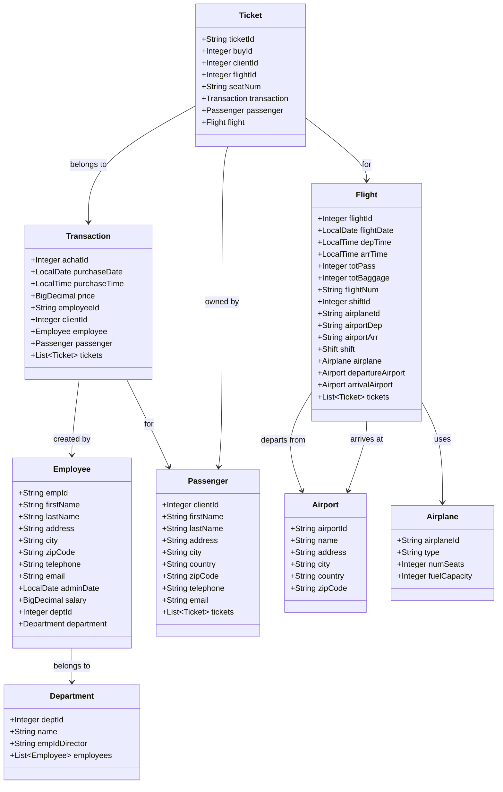
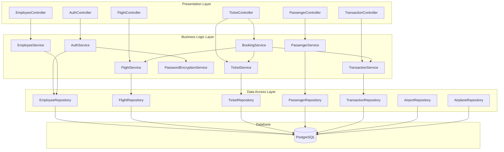
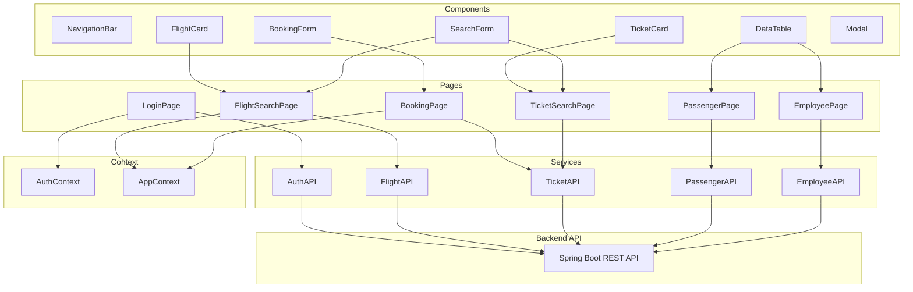

# Technical Design Document (TDD)
## COBOL Airlines System - Modernized

**Version:** 1.0  
**Date:** 2025-11-02  
**Architecture:** Spring Boot 3 + React + PostgreSQL

---

## Table of Contents

1. [System Architecture](#system-architecture)
2. [Class Diagrams](#class-diagrams)
3. [Component Diagrams](#component-diagrams)
4. [Database Design](#database-design)
5. [API Design](#api-design)
6. [Security Design](#security-design)
7. [Deployment Architecture](#deployment-architecture)

---

## 1. System Architecture

### 1.1 High-Level Architecture

```
┌─────────────────┐
│   React SPA     │ (Frontend)
│   Port: 3000    │
└────────┬────────┘
         │ HTTP/REST
         │
┌────────▼────────┐
│  Spring Boot    │ (Backend API)
│  Port: 8080     │
└────────┬────────┘
         │ JDBC
         │
┌────────▼────────┐
│  PostgreSQL     │ (Database)
│  Port: 5432     │
└─────────────────┘
```

### 1.2 Technology Stack

**Backend:**
- Spring Boot 3.2.x
- Spring Data JPA
- Spring Security (JWT)
- PostgreSQL Driver
- Lombok
- Bean Validation
- Jackson (JSON)

**Frontend:**
- React 18.x
- TypeScript
- TailwindCSS
- React Router v6
- Axios
- React Hook Form

**Database:**
- PostgreSQL 16
- Flyway (migrations)

**DevOps:**
- Docker & Docker Compose
- Maven (backend)
- npm/yarn (frontend)

---

## 2. Class Diagrams

### 2.1 Entity Layer



### 2.2 Service Layer

```mermaid
classDiagram
    class AuthService {
        +LoginResponse login(LoginRequest)
        +void logout(String token)
        +Employee getCurrentUser(String token)
    }
    
    class FlightService {
        +List~Flight~ searchFlights(FlightSearchCriteria)
        +Flight getFlightById(Integer)
        +Flight createFlight(FlightCreateRequest)
        +Flight updateFlight(Integer, FlightUpdateRequest)
        +List~Flight~ duplicateFlightsForMonth(Integer, LocalDate)
    }
    
    class TicketService {
        +List~TicketDetail~ searchTickets(TicketSearchCriteria)
        +TicketDetail getTicketById(String)
        +BookingResponse createBooking(BookingRequest)
        +byte[] printTicket(String)
    }
    
    class PassengerService {
        +List~Passenger~ searchPassengers(PassengerSearchCriteria)
        +Passenger getPassengerById(Integer)
        +Passenger createPassenger(PassengerCreateRequest)
        +Passenger updatePassenger(Integer, PassengerUpdateRequest)
        +ImportResult importFromXML(MultipartFile)
    }
    
    class EmployeeService {
        +List~Employee~ listEmployees(Integer deptId, Pageable)
        +Employee getEmployeeById(String)
        +Employee createEmployee(EmployeeCreateRequest)
        +Employee updateEmployee(String, EmployeeUpdateRequest)
        +ImportResult importFromJSON(MultipartFile)
    }
    
    class TransactionService {
        +Transaction getTransactionById(Integer)
        +byte[] printReceipt(Integer)
    }
    
    class PasswordEncryptionService {
        +String encryptPassword(String password, String userId, LocalDate adminDate)
        +boolean verifyPassword(String password, String encrypted, String userId, LocalDate adminDate)
    }
    
    class BookingService {
        +BookingValidation validateBooking(BookingRequest)
        +BookingResponse processBooking(BookingRequest)
        -void updateFlightSeats(Integer flightId, Integer count)
        -List~Ticket~ createTickets(Transaction, BookingRequest)
    }
    
    AuthService --> PasswordEncryptionService
    AuthService --> EmployeeService
    BookingService --> FlightService
    BookingService --> TicketService
    BookingService --> TransactionService
    BookingService --> PassengerService
```



### 2.3 Controller Layer

```mermaid
classDiagram
    class AuthController {
        +ResponseEntity~LoginResponse~ login(@RequestBody LoginRequest)
        +ResponseEntity~Void~ logout()
        +ResponseEntity~Employee~ getCurrentUser()
    }
    
    class FlightController {
        +ResponseEntity~FlightSearchResponse~ searchFlights(@RequestParam)
        +ResponseEntity~FlightDetail~ getFlight(@PathVariable Integer)
        +ResponseEntity~Flight~ createFlight(@RequestBody FlightCreateRequest)
        +ResponseEntity~Flight~ updateFlight(@PathVariable Integer, @RequestBody)
        +ResponseEntity~DuplicateFlightResponse~ duplicateMonth(@PathVariable Integer, @RequestBody)
    }
    
    class TicketController {
        +ResponseEntity~TicketSearchResponse~ searchTickets(@RequestParam)
        +ResponseEntity~TicketDetail~ getTicket(@PathVariable String)
        +ResponseEntity~BookingResponse~ createBooking(@RequestBody BookingRequest)
        +ResponseEntity~Resource~ printTicket(@PathVariable String)
    }
    
    class PassengerController {
        +ResponseEntity~List~Passenger~~~ searchPassengers(@RequestParam)
        +ResponseEntity~Passenger~ getPassenger(@PathVariable Integer)
        +ResponseEntity~Passenger~ createPassenger(@RequestBody)
        +ResponseEntity~Passenger~ updatePassenger(@PathVariable Integer, @RequestBody)
        +ResponseEntity~ImportResult~ importXML(@RequestParam MultipartFile)
    }
    
    class EmployeeController {
        +ResponseEntity~EmployeeListResponse~ listEmployees(@RequestParam)
        +ResponseEntity~Employee~ getEmployee(@PathVariable String)
        +ResponseEntity~Employee~ createEmployee(@RequestBody)
        +ResponseEntity~Employee~ updateEmployee(@PathVariable String, @RequestBody)
        +ResponseEntity~ImportResult~ importJSON(@RequestParam MultipartFile)
    }
    
    class TransactionController {
        +ResponseEntity~Transaction~ getTransaction(@PathVariable Integer)
        +ResponseEntity~Resource~ printReceipt(@PathVariable Integer)
    }
    
    AuthController --> AuthService
    FlightController --> FlightService
    TicketController --> TicketService
    PassengerController --> PassengerService
    EmployeeController --> EmployeeService
    TransactionController --> TransactionService
```



---

## 3. Component Diagrams

### 3.1 Backend Components



### 3.2 Frontend Components



---

## 4. Database Design

### 4.1 Table Relationships

- **Employee → Department**: Many-to-One (deptId)
- **Ticket → Transaction**: Many-to-One (buyId)
- **Ticket → Passenger**: Many-to-One (clientId)
- **Ticket → Flight**: Many-to-One (flightId)
- **Transaction → Employee**: Many-to-One (employeeId)
- **Transaction → Passenger**: Many-to-One (clientId)
- **Flight → Airport (departure)**: Many-to-One (airportDep)
- **Flight → Airport (arrival)**: Many-to-One (airportArr)
- **Flight → Airplane**: Many-to-One (airplaneId)
- **Flight → Shift**: Many-to-One (shiftId)

### 4.2 Indexes

**Primary Keys (Auto-indexed):**
- employee.empid
- department.deptid
- passenger.clientid (SERIAL)
- flight.flightid (SERIAL)
- ticket.ticketid
- transaction.achatid (SERIAL)
- airport.airportid
- airplane.airplaneid

**Foreign Key Indexes:**
- employee.deptid
- ticket.buyid
- ticket.clientid
- ticket.flightid
- transaction.employeeid
- transaction.clientid
- flight.shiftid
- flight.airplaneid
- flight.airport_dep
- flight.airport_arr

**Additional Indexes:**
- employee.email (UNIQUE)
- flight.flightnum
- flight.flight_date
- ticket.seatnum
- (flight.flightid, ticket.seatnum) UNIQUE
- passenger.email

---

## 5. API Design

### 5.1 Authentication Flow

```
1. POST /api/auth/login
   Request: { userId, password }
   Response: { token, user }

2. Subsequent requests include:
   Header: Authorization: Bearer {token}

3. Token validation in JwtAuthenticationFilter
```

### 5.2 Booking Flow

```
1. GET /api/flights?flightNum=...&flightDate=...
   → Search and validate flight

2. GET /api/passengers/{clientId}
   → Validate passenger exists

3. POST /api/tickets
   Request: {
     clientId, flightNum, flightDate, passengerCount,
     passengerDetails, paymentMethod
   }
   Response: {
     transactionId, tickets, totalPrice, receiptUrl
   }
```

### 5.3 Error Handling

All errors return standard format:
```json
{
  "errorCode": "ERR_XXX",
  "message": "User-friendly message",
  "timestamp": "2025-11-02T10:00:00Z",
  "details": {}
}
```

---

## 6. Security Design

### 6.1 Authentication

- **JWT Token**: HS256 algorithm
- **Token Expiration**: 24 hours
- **Token Storage**: HTTP-only cookie or localStorage (frontend)

### 6.2 Authorization

- **Role-Based**: Department ID determines access
- **Route Guards**: Frontend checks department before navigation
- **API Guards**: Backend validates department in JWT

### 6.3 Password Security

- **Legacy**: Custom encryption (for migration)
- **New**: BCrypt hashing (recommended)
- **Migration**: Convert legacy passwords on first login

---

## 7. Deployment Architecture

### 7.1 Docker Compose Setup

```
┌──────────────────┐
│   Docker Network │
│                  │
│  ┌────────────┐  │
│  │ Frontend   │  │ Port 3000
│  │ (React)    │  │
│  └────────────┘  │
│                  │
│  ┌────────────┐  │
│  │ Backend    │  │ Port 8080
│  │ (Spring)   │  │
│  └────────────┘  │
│                  │
│  ┌────────────┐  │
│  │ PostgreSQL │  │ Port 5432
│  └────────────┘  │
└──────────────────┘
```

### 7.2 Environment Variables

**Backend:**
- `DB_HOST=db`
- `DB_PORT=5432`
- `DB_NAME=airlines`
- `DB_USER=admin`
- `DB_PASSWORD=admin`
- `JWT_SECRET=...`
- `JWT_EXPIRATION=86400000`

**Frontend:**
- `REACT_APP_API_URL=http://localhost:8080/api`

---

## 8. Development Workflow

1. **Database Setup**: Run schema.sql and data.sql
2. **Backend**: `mvn spring-boot:run`
3. **Frontend**: `npm start`
4. **Testing**: `mvn test` (backend), `npm test` (frontend)

---

**End of TDD**

